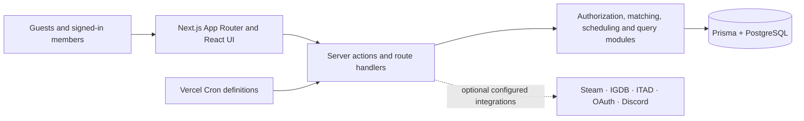

# What Should We Play?

**A game-night decision tool for friend groups: find a time everyone can make, then choose a game the group can actually play.**

[Source code](https://github.com/HazzJC/WhatShouldWePlay) · **Live demo:** no public deployment URL is recorded in this repository, so one is not claimed here. Run it locally using the steps below.


> **Visual note:** the repository includes the artwork above, but no committed UI screenshot, GIF, or independently verified public deployment. It is deliberately labelled as artwork rather than presented as evidence of a running interface.

## The problem

Choosing a game night usually means solving two connected problems in different group chats and services: **when can people meet?** and **what can this particular group play together?** What Should We Play keeps those decisions in one shareable Game Night.

- **Plan** is guest-first: create a session, share a link, collect availability, and rank time windows.
- **Pick** is account-backed: participating members can compare saved game libraries, player counts, platforms, preferences, price constraints, and session-specific signals.

The central product decision is intentional: planning remains usable without an account; private library matching requires an onboarded account and explicit membership. Steam is optional, not a prerequisite for joining a Pick workspace.

## What is implemented in this source tree

At `main` (`13f329f`, 13 September 2026), the application contains:

- Shareable Plan and Pick workspaces grouped beneath a Game Night.
- Availability capture, timezone-aware slot generation, ranked time recommendations, host locking, and `.ics` export.
- Persistent personal libraries and session-specific shortlist/interest signals, so suggesting a game is separate from claiming ownership.
- Recommendation scoring that represents ownership, player-count fit, platform fit, co-op setup, preferences, playtime, price, and uncertainty rather than hiding these behind a single opaque score.
- Public discovery routes plus optional Steam, IGDB, IsThereAnyDeal, Google, Microsoft, and Discord integrations when the corresponding environment variables are configured.
- Account, friend, group, library, privacy, export, and deletion routes backed by Prisma/PostgreSQL.

This is source-level implementation evidence, not a claim that every optional integration is configured or operational in a live environment.

## Product constraints and decisions

| Constraint | Design response |
| --- | --- |
| Guests should be able to coordinate a night quickly. | Plan can be joined from a share link without creating an account. |
| Libraries, ratings, and playtime are personal data. | Pick exposes private matching data only to permitted, joined account members. |
| “Can play” is not the same as “owns a copy.” | Persistent ownership, platform details, and per-session interest/veto signals have separate representations. |
| Platform and mod compatibility are often uncertain. | Matching records confirmed, unsupported, and uncertain states rather than turning missing evidence into a perfect match. |
| Console libraries cannot responsibly be scraped with brittle unofficial access. | Xbox and PlayStation identifiers can be recorded, while their library ownership is kept manual/platform-aware. |
| Provider data is optional and fallible. | Third-party enrichment is configuration-dependent; the core data model continues to represent missing or uncertain information. |

## Architecture



The project is a modular Next.js application rather than a distributed-services exercise. Its main seams are visible in `src/lib/session`, `src/lib/pick`, `src/lib/match-scoring.ts`, `src/lib/scheduling.ts`, the Prisma schema, and thin route/component adapters.

## Verification evidence

The repository has a [GitHub Actions quality workflow](.github/workflows/quality.yml) that runs `npm ci`, `npm test`, `npm run lint`, and `npm run build` for pull requests and pushes to `main`.

The most recent current-source checks are run and reported with each documentation change. They establish source/test/build health only; they do **not** demonstrate a deployed database, OAuth provider, Discord application, or scheduled job.

### Dimension 1 audit: historical baseline vs. current implementation

The [architectural integrity review](docs/reviews/01-architectural-integrity.md) and [Sol/Terra handoff](docs/reviews/01-sol-terra-handoff.md) document the **9 September 2026 baseline** at `fe110fe`. They are deliberately preserved as evidence of the original findings and proposed work; their opening status text is not a statement about `main` after the merge.

The implementation from `codex/dimension-1-architecture` was merged through [PR #1](https://github.com/HazzJC/WhatShouldWePlay/pull/1) in `13f329f`. Its focused tests are now ordinary assertions—there are no active `it.fails` cases in `audit/dimension-1`—covering corrected source-level contracts such as actor resolution, Pick membership/privacy, canonical ownership data, scoring boundaries, safe shortlist writes, DST handling, account/social integrity, and the Discord browser handoff.

That merge does **not** close the wider release gate. The audit and implementation did not independently verify:

- real PostgreSQL migration, rollback, and concurrency behaviour;
- authenticated browser journeys with real Google, Microsoft, or Steam providers;
- live Discord delivery or cron execution;
- production provider credentials, ingestion freshness/rate-limit resilience, deployment schema, or performance; and
- a signed-out public deployment or a representative UI capture.

Treat the audit’s later ingestion/performance/resilience recommendations as proposed follow-up work until they have their own implementation and live evidence. Do not use a passing synthetic test or build as a substitute for those checks.

## Run locally

### Prerequisites

- Node.js 22 (the CI workflow uses 22.12.0)
- PostgreSQL

Install dependencies and create a local environment file from the documented template:

```bash
npm install
copy .env.example .env
```

At minimum, set `DATABASE_URL`, `NEXT_PUBLIC_APP_URL`, and `AUTH_COOKIE_SECRET` in `.env`. The optional integrations listed in [`.env.example`](.env.example) need their own credentials and provider-side setup.

Apply the development schema, then start the app:

```bash
npm run prisma:migrate
npm run dev
```

For the repository’s default local Windows PostgreSQL setup, `npm run db:setup` creates the local database and a starter `.env` instead.

## Test and build

```bash
npm test
npm run lint
npm run build
```

Useful focused checks:

```bash
npm test -- audit/dimension-1 --reporter=verbose
npm run test:integration:dimension1
```

The integration harness requires a deliberately configured disposable local PostgreSQL target. Do not point it at production. `npm run build` compiles the application; production migration behaviour is intentionally a separate release step described in `scripts/migrate-deploy.mjs`.

## Status and next evidence needed

**Status: actively developed source; not presented as production-qualified.** The next high-value evidence would be an independently verified deployment URL, a real UI capture, database integration/concurrency results, authenticated end-to-end smoke journeys, and an observed cron/provider run with secrets kept outside the repository.

## Data, attribution, and licence

- Game metadata, storefront links, artwork, and deal information may be supplied by Steam, IGDB, and IsThereAnyDeal when configured. Their terms and attribution requirements still apply; the repository does not claim ownership of provider data.
- The bundled hero artwork is used by the application, but this repository does not document an asset licence or creation provenance for it. Do not reuse it outside this project without confirming rights with the repository owner.
- No `LICENSE` file is currently included. The source is therefore not offered here under an open-source licence; reuse requires permission from the copyright holder.
- Secrets, OAuth credentials, Discord tokens, and database URLs belong in local/deployment environment configuration, never in commits.

## Further documentation

- [Architecture audit baseline](docs/reviews/01-architectural-integrity.md)
- [Dimension 1 implementation handoff and release gates](docs/reviews/01-sol-terra-handoff.md)
- [Audit test context](audit/dimension-1/README.md)
- [Environment template](.env.example)
