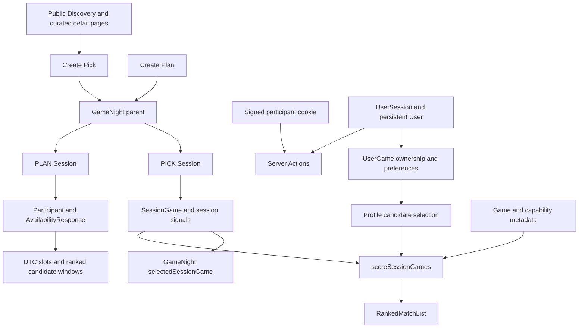

# Dimension 1 — Architectural integrity and core functional correctness

Review date: 9 September 2026. Source baseline: `fe110fe1132a630678c4e34206f3ceaad5979b9d` on `main`.

Status: **audit and execution plan; application fixes are not implemented or deployed by this review.** Dimensions 2–5 are deliberately deferred. Use [the Sol/Terra handoff](01-sol-terra-handoff.md) for implementation order, contracts, acceptance criteria and release gates.

## Assessment

The existing Next.js/React/Prisma/PostgreSQL stack is sufficient for the next stage. Keep the application as a modular monolith. The immediate architectural problem is inconsistent domain rules and authorization across entry points, rather than a missing service or caching product.

The principal release risks are:

1. Browser identity and account identity disagree. Anonymous hosts lose their host grant on availability submission; account switching can retain an earlier participant capability.
2. Ownership is represented both in persistent libraries and in session signals. Different matching paths consult different representations, producing stale or incomplete matches.
3. Capability inference, curated metadata, platform compatibility and scoring do not share a consistent definition of “this group can play.” A vetoed or incompletely verified game can still be “Perfect.”
4. Recommendations do not consistently lead to an actionable shortlist/final choice. Already signed-in non-Steam visitors cannot directly join a new Pick workspace.
5. Boundary cases in time zones, form serialization, mutations and account merging are absent from the existing journey tests.

No P0 incident or live exploitation was established. P1 below means a major supported journey, data integrity or privacy guarantee is broken and should block completion of dimension 1. P2 means a narrower correctness or recovery issue that still needs an explicit disposition before release.

## Evidence and limits

| Check | Result | What it establishes |
|---|---|---|
| Existing suite | 37 files, 111 tests passed | Existing assertions pass at the baseline; this is not complete journey coverage. |
| Existing lint | Passed | No configured lint violations at the baseline. |
| Production compilation | Passed; Next.js 16.3.2, Prisma Client 5.22.0; 33 static-generation entries | Source compiles and type-checks. `VERCEL_ENV=preview` ensured the build did not run release migrations. |
| New synthetic audit suite | 4 files, 24 checks passed: **21 expected failures and 3 characterization checks** | Reproduces baseline defects through real domain functions, actions and session-page composition with mocked external boundaries. Green here means the defects were reproduced, not repaired. |
| Final combined verification | 41 files, 135 checks reported passed; lint and `tsc --noEmit` passed | Includes the 21 explicitly expected failures above; the remaining 114 checks are ordinary passing assertions. |
| Source review | Routes, server actions, core libraries, schema, relevant migrations and components | Supports the code-confirmed findings and identifies concurrency risks. |
| GitHub open PR lookup | No open PR returned for this repository | No existing PR discussion was available for a status comment at audit time. |

Run `npm test -- audit/dimension-1 --reporter=verbose`. See [audit instructions](../../audit/dimension-1/README.md). Do not ship dimension-1 implementation with these known-broken invariants still marked `it.fails`.

The first sandboxed Vitest launch failed because its compiler could not read parent directories; the approved retry passed. A later approval-service usage limit temporarily blocked execution; after the user requested continuation, all 24 audit checks ran successfully.

This audit did **not** mutate a production database, complete live OAuth logins, send Discord messages, run real PostgreSQL concurrency stress tests, or measure browser/network latency. Privacy findings are supported by source and synthetic reads, not inspection of private user records. Current production row counts, duplicate prevalence, deployed schema and live provider credentials remain unverified. No claims about ingestion reliability, catalog freshness or performance targets are made here.

The file named `src/app/s/[shareToken]/session-page.test.tsx` imports and tests **Home**, not `SessionPage`. It must not be counted as existing session-route integration coverage. The added audit suite does execute the real session-page composition, but still mocks persistence and providers.

## Architecture and journey map

Important present-day boundaries: `GameNight` owns separate PLAN/PICK workspaces, not interchangeable tabs in one mutable session. Per-session participants are unique for a linked user. Session and game rows have durable IDs; a `profile:<gameId>` recommendation is currently a synthetic view row, not a persisted `SessionGame`.

| Journey | Actual trace | Result / gap |
|---|---|---|
| Browse by group size | `/discover?path=players&minPlayers=N` → `curatedGamesForList` → `/discover/[slug]` → `/games/[slug]` | Uses maximum native **or modded** capacity. Difficulty and duration are separate routes, not conjunctive filters. The count is lost when starting Pick. F06, F09. |
| Inspect game details | Discovery cards link to `/games/[slug]` → `enrichedCuratedGame` | Full pages exist for curated slugs. There is no game-detail modal or general canonical-game detail route. The audit does not pretend to have tested a nonexistent modal. F08. |
| Create Pick from a game | Detail → `/sessions/pick?game=slug` → auth/onboarding → `createPickSessionAction` | The slug survives auth, but initial shortlisting marks the host as an owner. Starting from an existing Pick is not supported by this CTA. F05, F09. |
| Join Pick | `/s/token` → `requireActivePickUser` → account provider redirect → `claimSessionParticipantForUser` | New sign-ins can claim/create membership because `providerStartUrl` reconstructs `shareToken`. An already signed-in non-member bypasses that callback; no direct join action is rendered. F03. |
| Import/reuse libraries | Account/Steam import → `UserGame`; session import also copies a bounded set into `SessionGame` and signals | Persistent and session copies drift. Saved-group sessions use a capped profile-candidate query; ownership is then reconstructed from the capped rows instead of the complete rows already loaded. F04. |
| Set constraints and rank | Session query parsing → profile/session candidates → `scoreSessionGames` → category tabs | Malformed/repeated IDs and numeric inputs are not canonicalized; separate forms discard other constraints. Capacity and confidence labels are inconsistent. F06, F07, F09, F10. |
| Agree on a game | `RankedMatchList` → intended shortlist → `selectFinalGameAction` → overview | Ranked profile candidates have no add/detail/final action; final selection is available only in a separate persisted-shortlist card. F08. |
| Plan without an account | `/sessions/new` → `createSessionAction` → signed host cookie → availability → ranked windows → host lock → ICS | Ordinary slot validation and guest isolation exist. Host cookie is downgraded by availability submission; DST transitions create invalid windows. F01, F11. |
| Reuse a saved group | Group owner → `startPickSessionFromFriendGroupAction` → accepted members copied to participants | Unique workspace/membership constraints exist. Blocked former group members remain eligible unless every consuming path checks blocks. F16. |
| Manage identities/history | Account update, library forms, merge, logout, archive removal | Empty values cannot clear some fields; history removal unlinks membership; merge can discard host role. F02, F13, F14. |
| Discord-created Plan | Verified interaction → `createDiscordSessionFromInteraction` → public browser link | Host has Discord identity only; no supported browser ownership handoff. F17. |

## Findings

### F01 — P1 — Saving availability removes anonymous host authority

**Evidence:** `src/app/actions.ts:236–238, 383–406, 507`; `src/lib/auth.ts:139–161, 184–189`. Reproduced in `identity.audit.test.ts`.

Creation calls `setParticipantIdentity(..., {isHost:true})`. Availability save calls it without options, replacing `isHost` with `false`. The database participant still says host, so the page renders host controls, but `requireHostParticipant` cannot authorize an anonymous user. A host can fill their availability and then be unable to lock the chosen time.

**Fix:** Refresh identity without downgrading an existing valid host capability. Derive authority from the persisted participant/owner and authenticated actor; do not accept client role input. Keep account-free Plan intact. Exercise create → submit → refresh → lock → ICS in one browser context and verify that a second context cannot lock.

### F02 — P1 — Account and participant identities disagree across logout/switching

**Evidence:** `src/lib/auth.ts:83–94, 176–234`; `src/app/actions.ts:43–69, 383–406, 827–839`; session page `:113–116`. Cookie residue and stale-cookie precedence are reproduced in `identity.audit.test.ts`.

`clearUserSession` only clears the account session. The participant map remains. `resolveActingParticipantId` trusts the cookie first without checking the participant's linked account; a mismatched submitted ID returns `null` before account fallback. The page prefers the signed-in account's membership, creating disagreement with actions. Cookie-authorized Plan/interest/host actions can outlive account logout, while stricter persistent-ownership writes reject them.

**Fix:** One actor resolver shared by reads and writes. A linked participant requires the same currently authenticated account. Guest capabilities apply only to genuinely anonymous participants. Account membership takes precedence over a stale browser cookie; a foreign cookie must neither authorize another account nor deny its valid membership. Preserve anonymous-host access explicitly rather than deleting all guest identities at logout. Add account A → logout → account B and dual-membership cases.

### F03 — P1 — An already authenticated non-Steam user cannot directly join Pick

**Evidence:** session page `:106–116`; `src/components/pick-panel.tsx:149–195`; `src/app/actions.ts:593–605, 1701–1740`; `src/lib/participant-identity.ts`. Synthetic page composition confirms that a signed-in non-member gets `participantId=undefined`.

An existing active account opening a new link can view matches but cannot add games: the action requires membership. Its rendered entry path is Connect Steam or Steam import. The Google sign-in link is hidden because the user is already signed in. Signing out and back in works through OAuth claim, but should not be the joining workflow.

**Fix:** An explicit, idempotent “Join this Pick” action for any active account, independent of library provider. Preserve the destination and constraints. Enforce unique membership and handle simultaneous join requests. Do not automatically claim arbitrary supplied participant IDs.

### F04 — P1 — Ownership counts depend on shortlist state and query truncation

**Evidence:** session page `:252–351, 426–428`; scoring `:203–259`; account actions `:298–314`; Steam session import `src/app/actions.ts:1760–1906`. Reproduced in domain and session audit tests.

The score's `have` count uses `SessionGameSignal`, not authoritative `UserGame.ownership`. Adding/removing persistent ownership later need not update other sessions. Profile candidates synthesize signals from `profileCandidateRows`, a **global 500-row cap across selected users**, ordered before grouping by game. A second query loads complete user-game rows for these games but the ownership calculation does not use it. Consequently, a co-owner whose candidate row falls below the cap is counted missing; games wholly below the cap are never considered. The UI readiness counter only checks persisted shortlist signals, so two populated libraries can still display “0 of 2 profiles.” Group-buy owned exclusion also ignores profile-only ownership.

**Fix:** Build one complete selected-user ownership matrix keyed by canonical game ID. Use it for all candidate sources, counts, readiness, matching and exclusions. Session interest/veto stays session-specific. Candidate selection must not silently change the mathematical answer at row 501; either enumerate the full eligible union in stable batches or compute it in the database with explicit completeness semantics. Output pagination must happen after eligibility/ranking, not by dropping owners from a candidate.

### F05 — P1 — Suggesting a game silently asserts ownership; some curated Add buttons reject valid games

**Evidence:** `src/app/actions.ts:318–330, 608–630, 637–659`; `src/lib/games.ts:40, 209–255`; `src/components/pick-panel.tsx:1155–1171`. Reproduced in `mutations.audit.test.ts`.

“Add” always writes `OWNED` and persistent `HAVE`, including search and group-buy suggestions. Initial detail-page shortlisting also asserts ownership. Neither control asks whether the user owns the game. Conversely, a curated suggestion carrying a Steam ID that is not yet persisted is rejected before the curated fallback is considered. A visible supported card can therefore fail on its first use.

**Fix:** Split “shortlist this game” from “I own this game.” Shortlisting defaults to no ownership change; explicit ownership edits have their own action. Resolve server-known curated identity before rejecting an absent provider row. Ensure the created shortlist entry and any explicitly requested signal update commit atomically. Initial Pick creation must not strand a half-created workspace if adding its initial game fails.

### F06 — P1 — Discovery and Pick use incompatible capability rules

**Evidence:** `src/lib/curated-games.ts:209–222`; `src/lib/match-scoring.ts:473–500, 1103–1123`; `src/lib/group-buy.ts:130–151`; `src/lib/games.ts:477–544`. Two domain reproductions demonstrate missing upper bounds and Discovery/Pick disagreement.

Discovery includes Subnautica for five players through `moddedMaxPlayers`; scoring overwrites the game with curated native capacity one and excludes it. There is no explicit setup choice connecting these interpretations. Discovery's “at least” test also ignores the minimum required players: this is acceptable as a maximum-capacity search only if it is not represented as an exact playable group. Scoring treats **either** known bound as fully supported, even when the other required bound is unknown. Curated fallback always overrides DB values, including later admin corrections. Generic multiplayer tags infer co-op and a four-player maximum without evidence. Group-buy checks only co-op flags even when its mode label says online/local group play.

**Fix:** A single capability resolver and tri-state eligibility function, with explicit online/local mode, native/modded setup and provenance. Do not promote missing data to supported or infer an exact capacity from a generic tag. Define exact group size separately from capacity browsing. Persist/reuse a selected modded setup through Discovery → details → Pick, with its caveats. Provider fetching and current mod validity belong to dimension 2; this phase fixes how existing facts are interpreted.

### F07 — P1 — “Perfect,” platform confidence and score explanations violate their own meaning

**Evidence:** scoring `:219–370, 650–683, 775–780, 873–993`; `src/components/ranked-match-list.tsx:87–117`. Reproduced for veto, platform completeness, overfilled group and tie ordering.

`categoriesFor` never sees vetoes or alignment and permits unknown platform compatibility. A game can have Low alignment due to “Not tonight” and still be Perfect. Platform intersection discards owners with missing platform sets; two PC owners plus a third unknown owner become “same-platform.” Four selected owners with playerCount=2 can get a two-player Perfect because `selectedCount >= requestedPlayerCount` is treated as filled, not contradictory. Time/commitment settings lower a score but do not exclude impossible known time fits. Online/local summary counts use a preference-adjusted factor, so strongly competitive preferences can suppress an actual co-op game's category count.

Scoring also reads `Date.now()` inside recency evaluation, accepts future timestamps as recent, and breaks ties only by localized title, leaving duplicate-title ordering dependent on input. The explanation renders eight of fifteen weighted factors and omits additive boosts from the decomposition.

**Fix:** Separate hard eligibility, confidence, ranking and explanation. Require an internally consistent group and no veto for Perfect; unknown critical compatibility cannot be “confirmed.” Use capabilities for mode filtering. Inject one `asOf` value, explicitly handle future timestamps, and add canonical ID as the final stable tie-breaker. Every displayed score must reconcile with all contributions and documented rounding. These are rule corrections, not a request to tune ranking weights blindly.

### F08 — P1 — The ranked profile recommendation cannot complete the consensus journey

**Evidence:** session page `:299–339`; `src/components/ranked-match-list.tsx:30–126`; `src/components/pick-panel.tsx:1059–1085`; `src/app/actions.ts:1542–1563`.

Synthetic profile recommendations have no detail, shortlist, session-interest or final-choice action. Only persisted shortlist cards provide final selection. The user sees “Step 3 · Choose” but cannot choose the ranked candidate there. Results are sliced to 16 without access to the rest; uncertain picks are separately sliced to four. This is inaccessible functionality, beyond a dimension-3 rendering optimization.

**Fix:** A recommendation carries `gameId`, nullable persisted `sessionGameId`, and permitted actions. Provide an idempotent shortlist action and a canonical detail destination; then expose per-session preference/final-choice controls where authorized. Use a finite “show more”/pagination contract. Do not send `profile:<id>` as a database identifier. A modal may be added later; a working detail page is sufficient for dimension 1.

### F09 — P2 — URL/form filters are neither canonical nor composable

**Evidence:** session page `:208–211, 687–752`; `src/components/pick-panel.tsx:324–326, 485–541, 855–897`; `src/lib/player-count.ts:1–6`; library page `:28–78`; Discovery page `:32–49`; detail page `:34, 125`. Invalid IDs and Infinity are reproduced against the real page.

Selected IDs are not deduplicated or intersected with session members, so displayed profile counts can differ from the scoring denominator. Unchecking all boxes defaults back to everyone. Session player counts accept Infinity/fractions and lack the UI's upper bound on the server. Library page numbers can become noninteger/Infinity Prisma offsets. Match, search and group-buy GET forms each submit a partial query, silently resetting the other controls. `avoidOwned` is false only for `off`, while the checkbox submits `on` or nothing, making it impossible to turn off normally. Discovery uses a default five-player filter on direct category links and does not carry a selected count into new Pick creation.

**Fix:** One typed parser/serializer for each route and one shared Pick query state. Reject or normalize nonfinite/fractional/out-of-range values before database/scoring work. Define absent selection (“default group”) versus explicit empty (“choose players”), preserve sibling fields and represent booleans explicitly. Discovery difficulty/duration are currently alternative routes: either label that clearly or implement an explicit conjunction; do not silently claim combinations that are not applied.

### F10 — P2 — Group-buy constraints can mislabel unsuitable recommendations

**Evidence:** `src/lib/group-buy.ts:36–116`; session page `:414–435`; `src/components/pick-panel.tsx:858–895`. Budget and section errors are reproduced.

Known over-budget candidates are only penalized, not excluded, and the over-budget warning is appended fourth then removed by `reasons.slice(0,3)`. Unknown prices receive the within-budget bonus. `add(section, candidate=candidates[0])` substitutes the best candidate when `find` returns undefined, fabricating “long term,” “trending,” or “cheapest” sections. For example, a one-night-only request produces a long-term section. A multiword genre input such as the form's “co-op survival” placeholder is matched as one substring inside a single tag, not as an intersection. Owned exclusion consults only shortlist signals.

**Fix:** Specify budget as per-person minor units in the selected market currency, with a separate unknown-price state; do not claim unknown prices satisfy a budget. Filter known failures, include sections only when their predicate actually matches, tokenize/normalize multiple tags with a documented operator, and consume the authoritative ownership matrix. No currency conversion or paid pricing system is required in this phase.

### F11 — P1 — Daylight-saving transitions produce invalid availability windows

**Evidence:** `src/lib/scheduling.ts:80–140`; `src/app/actions.ts:408–451, 508–512`. Both London 2026 transitions are reproduced.

Iterating local hour labels and converting each independently causes duplicate UTC instants at the spring transition. Availability can then reject the rendered slots as duplicates. At the autumn transition, the repeated hour is omitted and a window of two listed slots can span three elapsed hours. Candidate generation slices slots without verifying adjacency, and locking validates against those same faulty candidates.

**Fix:** Enumerate real instants inside each local day's configured window; represent repeated local hours distinctly (offset/abbreviation), omit nonexistent ones and require each candidate's UTC slots to be contiguous. `requiredDuration` means elapsed hours. Preserve actual minimum/start/end bounds, explicit host override of a low-attendance time, weekend windows and existing ICS UTC timestamps. Validate London and at least one other DST zone plus a non-DST zone, including the 24:00 boundary.

### F12 — P1 — Canonical identity and metadata writes can corrupt shared facts

**Evidence:** `src/lib/games.ts:171–205, 321–329, 477–544`; schema `Game` provider IDs and nonunique normalized title. Metadata overwrite and false co-op inference are reproduced.

A title-only add finds an existing Game and updates it. The inference helpers return `false` for absent modes, so this user operation overwrites known online/local capability flags. A Steam import always creates/looks up by Steam ID; an earlier manual/IGDB-only row for the same game can remain separate. Since matching keys by gameId, those owners no longer match. The title advisory lock prevents simultaneous manual duplicates but does not unify different provider branches. Title equality alone is also insufficient evidence for merging editions/remakes.

**Fix:** Sparse updates must distinguish absent, known false and known true. Canonicalize through verified provider links/stable IDs with explicit ambiguity handling; do not introduce blanket unique-title constraints or mass title-based merges. Produce a read-only duplicate report, then a provenance-preserving, idempotent reconciliation for verified duplicates, resolving every dependent unique relation transactionally. Keep old-ID aliases/audit records if published links would otherwise break. Live duplicate prevalence is not established by this review.

### F13 — P1 — Account merge can discard a host role and does not define all conflict precedence

**Evidence:** `src/lib/account-merge.ts:25–41, 94–99, 145–160, 166–210, 214–234`; `src/app/actions.ts:57–69`. Code-confirmed; real transactional merge testing remains required.

When the destination account already has a guest participant in a session and the source account has the host participant, merge moves dependent records and deletes the source participant without promoting the retained one to host. An owner fallback still requires a host participant row, so a session can lose its usable host path. Response/signal/interest conflicts always favor the source participant, without comparing modification time. Blocks and friendships are merged independently, allowing an inconsistent relationship state; email verification is combined independently from the chosen email value. The intent is read before the transaction rather than consumed with a conditional compare-and-set inside it.

**Fix:** Specify merge precedence and preserve the union of valid host authority, current-account field choices and all relevant dependencies. Consume the merge intent once inside the transaction; retry/return safely on conflicts. Blocks must dominate friendship and library visibility. Verification must belong to the retained email. Test duplicate memberships, opposing signals, ownership/platform unions, two merge submissions and two distinct Steam accounts. Do not perform a live merge to validate this audit.

### F14 — P2 — Mutation validation, concurrency and empty-field semantics are incomplete

**Evidence:** `src/app/actions.ts:390–451, 608–631, 269–330`; `src/lib/participant-identity.ts:21–50`; account actions `:210–253, 275–314`. Empty-rating behavior is reproduced; concurrency outcomes require PostgreSQL tests.

Availability creates/updates a participant and sets a cookie before validating every submitted slot. Invalid input can leave a phantom participant and change recommendation denominators. Multirow shortlist/library writes are not one transaction. Joining/claiming uses read-then-create/update around unique membership and can fail during simultaneous requests. Availability replacement is transactional but lacks a revision precondition, so two tabs can silently overwrite each other. Clearing rating or notes passes `undefined`, which omits a Prisma update instead of clearing the saved value. “Remove from history” nulls a guest's `userId`, changing membership and matching rather than just history visibility.

**Fix:** Validate before writes; group invariant-related writes into a short transaction; define idempotency and conflicts per command. Use a revision/compare-and-set for destructive replacement of availability; return a recoverable conflict without losing draft input. Write `null` for explicit clears. Introduce separate history visibility state if the product intends “hide,” otherwise explicitly make this a leave action and revoke membership capability consistently. Preserve the explicit host-delete confirmation flow.

### F15 — P2 — The “internal redirect” validator accepts a browser-normalized external URL

**Evidence:** `src/lib/auth.ts:343–349`; `src/app/auth/logout/route.ts`; `src/app/admin/games/actions.ts:29–33`. Shared-helper behavior is reproduced with the non-routable `example.invalid` domain.

The validator checks only a leading slash and absence of `//`. A slash followed by a backslash passes that test, but URL normalization treats it as an authority separator. A redirect intended to remain in the app can resolve to another origin.

The admin metadata action also uses raw form `returnTo` in its validation-failure branch, before the successful-schema path's restriction applies. Include error branches in the redirect call-site review; admin authorization does not make a return URL valid.

**Fix:** Canonicalize against a fixed allowed origin, reject backslashes/control characters and foreign origins, then emit only pathname/search/hash. Apply the same validator to all return destinations. Keep legitimate query strings and fragments. No production redirect was exercised.

### F16 — P1 — Privacy enforcement differs between profiles, matching and saved groups

**Evidence:** `src/app/users/[username]/page.tsx:25–65, 103–123`; session page `:109–116, 252–351`; `src/app/friends/actions.ts:154–185`; `src/app/actions.ts:1311–1357`. Synthetic session test confirms non-member access to match output.

The non-friend profile promises that ownership and ratings remain private, yet its favourite cards render both, plus playtime. A signed-in holder of a Pick link can load selected users' library-derived titles/ownership/playtime without joining or passing friend/block checks; selecting one participant narrows the output to that person's library. Blocking removes friendships and requests but not accepted saved-group memberships, and saved-group creation of Pick does not recheck blocks. This is inconsistent with both the UI privacy promise and a meaningful block operation.

**Fix:** Define public favourite DTOs separately from private library DTOs. Public favourites may contain title/art only. Shared Pick needs explicit membership and session-scoped matching consent, while full personal libraries remain self/accepted-friend only. Check blocks on every path consuming another user's library, including existing groups and shared links. Apply filtering before loading/serializing private fields. Do not equate “server component” with automatic authorization.

### F17 — P1 — Discord-created sessions do not provide a usable browser host handoff

**Evidence:** `src/lib/discord.ts:175–234`; `src/lib/auth.ts:291–316`; `src/lib/participant-identity.ts`; `src/app/actions.ts:43–74`.

Discord creates an unlinked host participant identified by `discordUserId` and an ownerless GameNight. Its browser link is a public token. There is no browser Discord authentication/verified claim route, and Google/Steam cannot safely adopt the host merely from a participant query parameter. This protects against impersonation, but leaves the actual creator unable to manage the browser session through the advertised flow.

**Fix:** Share the core create/join/host policy. For the existing Discord entry, return a short-lived, single-use host handoff in a response visible only to the verified interaction user, or use a supported authenticated Discord account-link flow. Never publish a host capability in the channel's share URL. This phase covers identity correctness; reminder delivery and Discord/provider resilience remain dimension 2 work.

### F18 — P2 — Expected errors and client state are not reconciled consistently

**Evidence:** `src/app/s/[shareToken]/error.tsx`; action validation throws throughout `src/app/actions.ts`; `src/components/game-signal-controls.tsx:24–50`; `src/components/post-import-status.tsx:18–39`; `src/components/app-navigation.tsx:21–26`; `src/components/player-count-filter.tsx:5`; availability form `:87–93`.

Only the session subtree has an application-specific error boundary. Expected validation/permission failures generally throw, replacing context with a generic load error or the framework default. Several components initialize state from props without a reconciliation policy for server refresh, account changes or navigation. Optimistic signal controls have no explicit ordering/conflict mechanism; stale rollback is a risk to test rather than a proven concurrent database failure. Post-import status marks recommendations ready immediately after calling `router.refresh()` rather than when new data arrives; its one-shot ref can also defeat Strict Mode effect setup after cleanup. The header's auth read runs only on mount and can remain stale after a soft-navigation auth change.

**Fix:** Typed action results for expected failures, field-level errors and retained drafts; scoped boundaries for unexpected failures. Reconcile optimistic state by mutation identity/server revision and test rejection/order changes. Derive ready state from actual returned data. Centralize invalidation for affected workspace, overview, library and archive routes; test what other tabs/users see before choosing a refresh mechanism.

**Resource/dead-code audit:** The availability pointer listener, avatar/share Escape listeners and import timers have explicit cleanup. The Prisma singleton is reused across environments. No persistent memory leak was established. Short-lived clipboard timers and uncancelled one-shot reads warrant cleanup, not a claim of an unbounded leak. Most apparent legacy paths (Steam shortlist copying, duplicate scoring cards, unused `participantId` prop on SessionTabs, form metadata parsed but ignored by canonical resolution) need call-site verification as ownership/DTO extraction proceeds. Do not run an indiscriminate dead-code deletion pass.

## Rules that are already sound and must survive

- Signed httpOnly cookies, production secret requirement, hashed account-session tokens and expiration checks.
- OAuth browser nonce/state checks; provider IDs rather than display names establish identities.
- Host-only action checks, workspace-type checks, and validation that a selected game belongs to the requested workspace.
- Unique `(sessionId,userId)`, `(gameNightId,workspaceType)`, `(sessionId,gameId)` and signal/interest pairs; cascading dependent rows and `SetNull` final-choice behavior.
- Conditional single-use acceptance in friend/group invite actions. Other commands should follow this pattern where applicable.
- Whole-window availability semantics: one unavailable/missing hour excludes a participant for that candidate; available count wins, then maybe count, then chronological order.
- Explicit canonical game IDs when adding an existing catalog record, bounded Steam write batches and the manual-title advisory lock within its actual scope.
- Separate persistent interest from `NOT_TONIGHT`, explicit account merge confirmation, and the existing interactive form/draft affordances.

## Architectural direction

Extract a small number of domain modules instead of splitting the deployment:

1. **Authorization and DTO boundary:** resolve actor once; authorize view/join/participant/host operations separately; return only permitted data. This follows the [Next.js data-security guidance](https://nextjs.org/docs/app/guides/data-security).
2. **Canonical match snapshot:** selected members, complete per-game ownership/platform matrix, session interests, capabilities and one evaluation time. It is private request data. No shared cache of identity-bearing results is proposed.
3. **Pure eligibility and scoring:** constraint validation first, supported/unsupported/unknown outcome second, ranking and explicit explanation last.
4. **Command services:** validate → authorize → transactional write/conditional conflict check → invalidate → typed result. Keep network calls outside transactions. Prisma documents transactional isolation and conflict handling in its [transaction reference](https://www.prisma.io/docs/orm/v6/prisma-client/queries/transactions); confirm APIs against the installed 5.22 client rather than upgrading to follow a current example.
5. **Thin route/component adapters:** one query codec, one recommendation DTO and one actionable card contract. Expected failures become useful UI state, consistent with [Next.js error handling](https://nextjs.org/docs/app/getting-started/error-handling).

No Redis, new ORM, authentication rewrite, microservices, paid scheduler or paid observability dependency is required to correct these invariants. Database indexing, bundle measurement, provider ingestion, evergreen curation and broad visual redesign are deferred to their assigned dimensions.

## Review checkpoint

Review the policy defaults and packet order in the handoff before execution. Dimension 1 is complete only after its fixes, migrations where necessary, normal regression tests, real database integration tests and authenticated deployed smoke journeys pass. At that point review the release evidence together, then begin dimension 2. This audit document alone does not satisfy that deployment gate.
